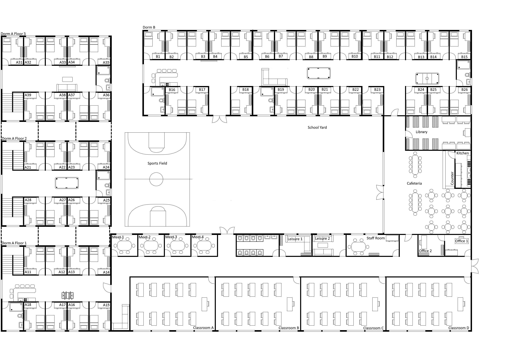

# Scenario Purpose

This scenario illustrates how a lager-scale scenario can be built from the simulation system. The scenario represents the developmet of an on-campus residential universities over multiple years with growing student number. Student numbers start at 20 students and grow to 50 over multiple years.

# Useage

The scenario can be started as a module via *python -m examples.complex_scenario.main <execution_mode>* from the main folder of the project.

Execution mode can have one of three values:
- *RECORD*: runs the simulation for 5 years, recording presence data. Data will be stored in *data/recording.pickle* and can be explored using *data_exploration.ipynb*
- *VIEW*: runs the simulation indefinitely with predictions and a user interface. No data will be recorded.

# The Scenario:

The scenario is defined in src/complex_scenario.py. 

Here we describe a short summary of the scenario:

## Campus and Occupants:

The layout of the campus is as follows

The campus consists of a set of areas:
- Dorm Area A, which is a tower with 3 floors on the eastern side of the campus. The area consists of 25 dormitories, three bathrooms and several amenities (couch, TV, pool table, kitchen area, kicker table)
- Dorm Area B, which forms the north side of the campus. The area consists of 26 dormitories, three bathrooms and several amenities (couch, kitchen area, pool table, air hockey table)
- Classroom Area, which forms the south-east part of the campus. The area consists of four classrooms, four meeting rooms, a bathroom, two leisure rooms, a staff room and principal offices.
- Cafeteria, which is located on the eastern side of the campus. The area contains the main cafeteria and the library.
- Schoolyard, which is in the center of the campus. In addition to an outdoors area, the yard also contains a sports field, where different sports can be pursued (symbolized by a basketbal cort)

The campus contains three types of occupants:
- Students, who live in dormitories and attend classes.
- Teachers, who live off-campus but are on campus during their work hours.
- Office Staff (Principal and secretary), who live off-campus but are on campus during their work hours.

## Schedules:

Lessons take place in four blocks:
| Block | Start | End |
| ---------- | ---- | -------- | 
| 1 | 8:15 | 9:45 |
| 2 | 10:15 | 11:45 |
| Lunch Break | 12:00 | 13:00 |
| 3 | 13:15 | 14:45 |
| 4 | 15:15 | 16:45 |

Students are organized in classes and each class has lessons on three of the four slots each day.

Furthermore, the school offers a set of clubs that take place at specific times and that students can join.

Any time not spent in these obligations is divided into different leisure activities that take place at varying places around campus.

Teachers are assigned to lessons and clubs, which determine their work scheduled. Free times in between is spent via a smaller selection of activities (preparing in the staff room, bathroom breaks and eating in the cafeteria).

The principal and their secretary are spending most of their time in their respective offices.

## Variability: 
The scenario runs from 01.04.2020 for approximately five years. Variability is introduced by various aspects:

### Semester times:
One school year consists of lecture periods and break periods. The lecture period of the summer semester runs from April till end of June. The lecture period of the winter semester runs from October till end of January. During these times, students follow the above-described schedules.

In between lecture periods (from July till end of September and from February till end of March) the scenario changes. On the one hand, lessons and clubs do not take place during these times. On the other hand, a percentage of students leaves the campus for the holidays and will return for the next lecture period.

This means, during break periods the schedule of students is a lot less determined by scheduled obligations and there are less students on campus.

### Student Intakes:
Each semester, a student intake happens, meaning some students leave the school and other students get accepted. This changes both the absolute number of students as well as the likelihood of leisure activities (as new students have different leisure activity preferences).

The intake numbers are as follows:

| Semester | Graduates | New Students | Number of Students |
| ---------- | ---- | -------- | ---- |
| 1 | - | - | 20 |
| 2 | 10 | 20 | 30 |
| 3 | 15 | 25 | 40 |
| 4 | 20 | 30 | 50 |
| 5 | 25 | 25 | 50 |

### Construction in Dorm B:
Initially, Dorm B is closed as it is still constructed. All rooms within it are unavailable to students. On first of September during the first year (meaning in the middle of summer break) the dorm opens and becomes accessible. 

# Project Structure

The project is structured along the following folders:
- *data*: this folder contains the data recorded as part of this scenario.
- *images*: contains images for visualizing the scenario and displaying it in the simulator
- *notebooks*: contains Python Notebooks to visualize the collected data.
- *src*: contains source code.

