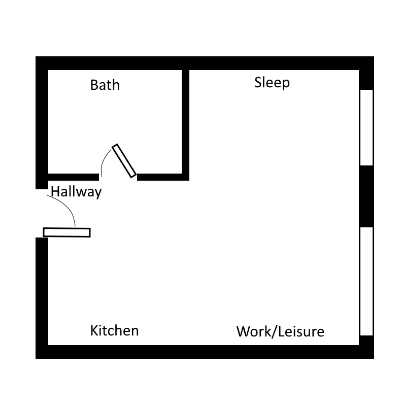

# Scenario Purpose

This scenario showcases gradual changes within the scenario-based simulation engine. More specifically, it is designed to illustrate how to ...
- define a scenario for the simulation
- define gradual changes for the scenario
- define custom gradual changes

# Useage

The scenario can be started as a module via *python -m examples.gradual_change_scenario.main <execution_mode>* from the main folder of the project.

Execution mode can have one of three values:
- *RECORD*: runs the simulation for 8 months, recording presence data. Data will be stored in *data/recording.pickle* and can be explored using *data_exploration.ipynb*
- *VIEW*: runs the simulation indefinitely with predictions and a user interface. No data will be recorded.

# The Scenario:

The scenario is defined in src/gradual_change_scenario_.py. 

Here we describe a short summary of the scenario:

## House and Occupants:

It consists of a student apparmtment with five areas. The layout of the house is as follows:

The house has one occupant, Alina, who is a student.

## Schedules:

Alina's daily schedule differs between weekdays and weekends. The two schedules are as follows:

### Weekday:
| Obligation | Time | Location |
| ---------- | ---- | -------- | 
| Breakfast | 7:00 - 07:30 | Kitchen|
| University       | 10:00 - 16:00 | Outside |
| Dinner | 21:00 - 21:30 | Kitchen |

### Weekend:
| Obligation | Time | Location |
| ---------- | ---- | -------- | 
| Breakfast | 10:00 - 10:30 | Kitchen|
| Lunch | 14:00 - 15:00 | Kitchen |
| Dinner | 23:00 - 23:30 | Kitchen |

## Leisure Activities:
Alina fills her leisure time with the following activities:

| Activity | Location | Priority |
| ---------- | ---- | -------- | 
| Socializing | Outside | 2|
| Studying | Sleep Area | 1|
| Snacking | Kitchen | 2 |
| Watching TV | Living Room | 4 |

## Variability:
The scenario contains four distinct phases:

During the two month (January and February 2020) the scenario is stable.

During following two months (March and April 2020), Allina's gradually changes her weekay bed time habits. This is reflected by her weekday breakfast and dinner times gradually shifting to two hours later. The change is meant to symbolize decreasing motivation for her studies.

During May and June, the scenario is stable again.

The fourth phase is meant to represent the opposite of the second phase as Alina's study motivation returns. Over the next two months (July and August), she gradually shifts her eating times to two hours earlier (for weekdays and weekends). In addition, the priority of studying gradually increases to 5, while watching TV and socializing gradualy decrease to 1, representing a gradual shift in her study motivation.

After this, the scenario remains stable.

Concurrently to these phases, the weather changes throughout the year, which will influence the probability of activity "Socializing" to be chosen.

# Project Structure

The project is structured along the following folders:
- *data*: this folder contains the data recorded as part of this scenario.
- *images*: contains images for visualizing the scenario and displaying it in the simulator
- *notebooks*: contains Python Notebooks to visualize the collected data.
- *src*: contains source code.

