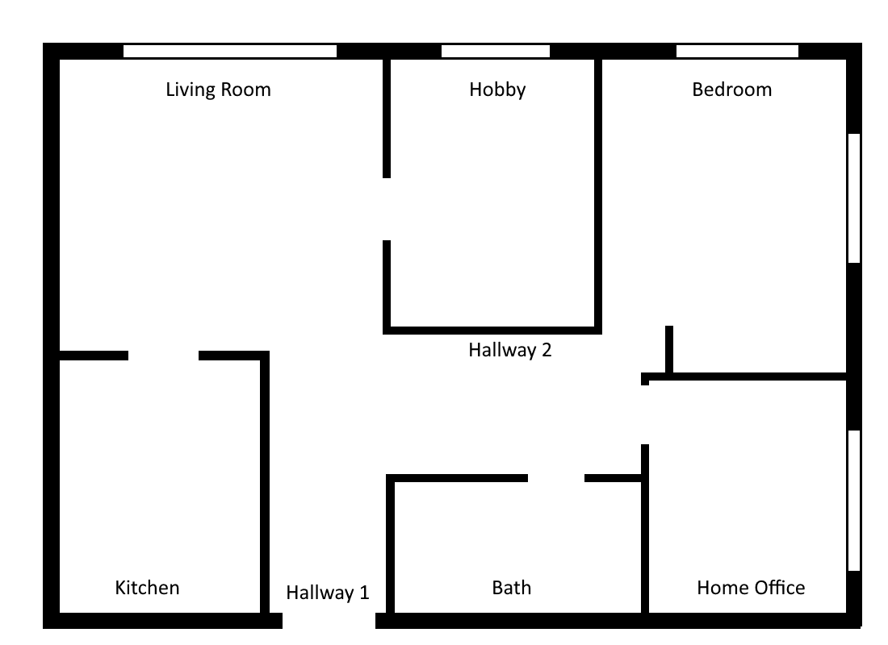

# Scenario Purpose

This scenario showcases adapting the scenario to changing rooms. More specifically, it is designed to illustrate how to ...
- add / remove rooms from the simulation
- set up the simulation so it adapts to availability of rooms. 

# Useage

The scenario can be started as a module via *python -m examples.room_change_scenario.main <execution_mode>* from the main folder of the project.

Execution mode can have one of three values:
- *RECORD*: runs the simulation for 8 months, recording presence data. Data will be stored in *data/recording.pickle* and can be explored using *data_exploration.ipynb*
- *VIEW*: runs the simulation indefinitely with predictions and a user interface. No data will be recorded.

# The Scenario:

The scenario is defined in src/room_change_scenario_.py. 

Here we describe a short summary of the scenario:

## House and Occupants:

It consists of a student apparmtment with five areas. The layout of the house is as follows:

The house has two occupants: Anna and Bettina. Both sleep in the same room and use the other rooms for various work and leisure activities.

## Schedules:

Anna's and Bettina's daily schedules differ between weekdays and weekends. The two schedules are as follows:

### Weekday - Anna:
| Obligation | Time | Location |
| ---------- | ---- | -------- | 
| Breakfast | 6:00 - 06:30 | Kitchen|
| Work       | 8:00 - 17:00 | Outside |
| Dinner | 19:00 - 20:00 | Kitchen |

### Weekday - Bettina:
| Obligation | Time | Location |
| ---------- | ---- | -------- | 
| Breakfast | 9:00 - 09:30 | Kitchen|
| Work       | 10:00 - 18:00 | Home Office |
| Dinner | 19:00 - 20:00 | Kitchen |

### Weekend - Anna:
| Obligation | Time | Location |
| ---------- | ---- | -------- | 
| Breakfast | 08:30 - 09:00 | Kitchen|
| Lunch | 13:00 - 14:00 | Kitchen |
| Dinner | 19:00 - 20:00 | Kitchen |

### Weekend - Bettina:
| Obligation | Time | Location |
| ---------- | ---- | -------- | 
| Breakfast | 10:30 - 11:00 | Kitchen|
| Lunch | 13:00 - 14:00 | Kitchen |
| Dinner | 19:00 - 20:00 | Kitchen |

## Leisure Activities:
Anna fills her leisure time with the following activities:

| Activity | Location | Ressources | Priority |
| ---------- | ---- | -------- | -------- | 
| Reading | Living Room, Bedroom, Hobby Room | - | 1|
| Sewing | Living Room, Bedroom, Hobby Room | Sewing Machine | 3|
| Crafting | Living Room, Bedroom, Hobby Room | Crafting Materials | 4|
| Painting | Living Room, Bedroom, Hobby Room | Painting Materials | 2|
| Shopping | None (outside) | -  | 2|
| Cooking | Kitchen | -  | 1|
| Digital Art | Home Office, Living Room | PC | 1|
| Watching TV | Living Room | TV  | 1|

Bettina has the following activities

TODO:  this is messed up. Needs to be corrected!

| Activity | Location | Ressources | Priority |
| ---------- | ---- | -------- | -------- | 
| Reading | Living Room, Bedroom, Hobby Room | - | 2|
| Crafting | Living Room, Bedroom, Hobby Room | Crafting Materials | 2|
| Shopping | None (outside) | -  | 1|
| Self-Education | Home Office, Living Room, Hobby Room | PC  | 3|
| Creative Writing | Home Office, Living Room, Hobby Room | Desk  | 3|
| Gaming | Home Office, Living Room, Hobby Room | PC  | 3|
| Watching TV | Living Room | TV  | 3|

## Variability:
TBD

# Project Structure

The project is structured along the following folders:
- *data*: this folder contains the data recorded as part of this scenario.
- *images*: contains images for visualizing the scenario and displaying it in the simulator
- *notebooks*: contains Python Notebooks to visualize the collected data.
- *src*: contains source code.

