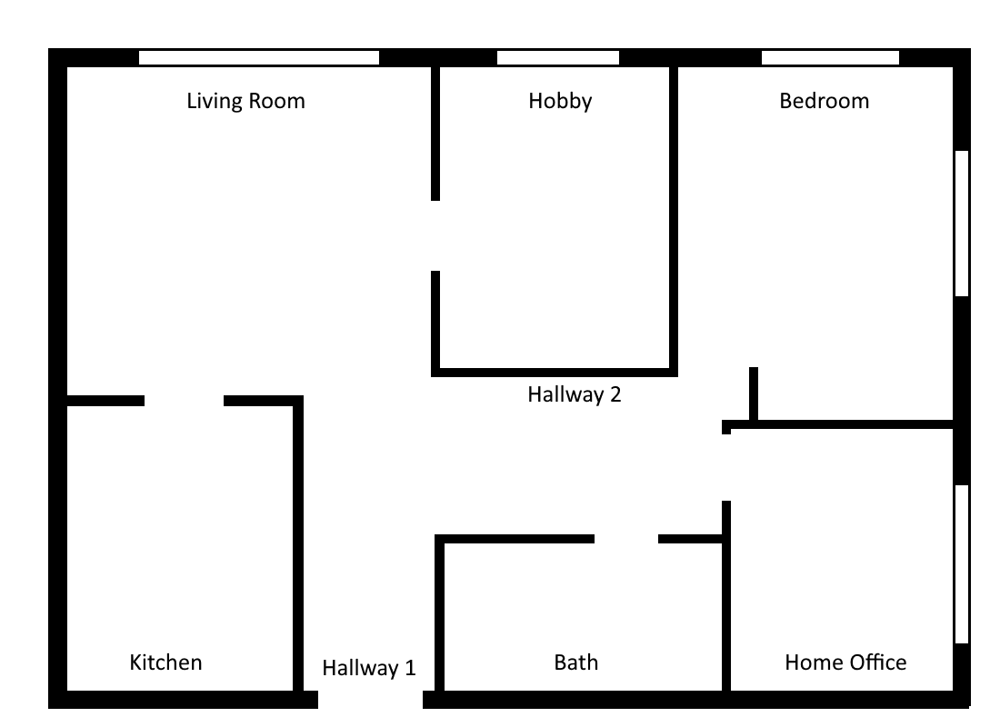

# Scenario Purpose

This scenario showcases adapting the scenario to changing rooms. More specifically, it is designed to illustrate how to ...
- add / remove rooms from the simulation
- set up the simulation so it adapts to availability of rooms. 

# Useage

The scenario can be started as a module via *python -m examples.room_change_scenario.main <execution_mode>* from the main folder of the project.

Execution mode can have one of three values:
- *RECORD*: runs the simulation for 8 months, recording presence data. Data will be stored in *data/recording.pickle* and can be explored using *data_exploration.ipynb*
- *VIEW*: runs the simulation indefinitely with predictions and a user interface. No data will be recorded.

# The Scenario:

The scenario is defined in src/room_change_scenario_.py. 

Here we describe a short summary of the scenario:

## House and Occupants:

It consists of a student apparmtment with five areas. The layout of the house is as follows:

The house has two occupants: Anna and Bettina. Both sleep in the same room and use the other rooms for various work and leisure activities.

The rooms also have a set of special ressources that limit which activity can be done in which room. At the beginning of the scenario, these are distributed as follows:
- A PC and a Desk are located in the home office.
- A TV is located in the living room.
- A Sewing Machine, as well as Crafting Materials and Painting Materials are located in the hobby room.

During the course of the simulations, rooms will be closed and opened and these ressources will be shifted around in order to enable the schedule of occupants to adapt. This is described in Section *Variability*

## Schedules:

Anna's and Bettina's daily schedules differ between weekdays and weekends. The two schedules are as follows:

### Weekday - Anna:
| Obligation | Time | Location |
| ---------- | ---- | -------- | 
| Breakfast | 6:00 - 06:30 | Kitchen|
| Work       | 8:00 - 17:00 | Outside |
| Dinner | 19:00 - 20:00 | Kitchen |

### Weekday - Bettina:
| Obligation | Time | Location |
| ---------- | ---- | -------- | 
| Breakfast | 9:00 - 09:30 | Kitchen|
| Work       | 10:00 - 18:00 | Home Office |
| Dinner | 19:00 - 20:00 | Kitchen |

### Weekend - Anna:
| Obligation | Time | Location |
| ---------- | ---- | -------- | 
| Breakfast | 08:30 - 09:00 | Kitchen|
| Lunch | 13:00 - 14:00 | Kitchen |
| Dinner | 19:00 - 20:00 | Kitchen |

### Weekend - Bettina:
| Obligation | Time | Location |
| ---------- | ---- | -------- | 
| Breakfast | 10:30 - 11:00 | Kitchen|
| Lunch | 13:00 - 14:00 | Kitchen |
| Dinner | 19:00 - 20:00 | Kitchen |

## Leisure Activities:
Anna fills her leisure time with the following activities:

| Activity | Location | Ressources | Priority |
| ---------- | ---- | -------- | -------- | 
| Reading | Living Room, Bedroom, Hobby Room | - | 1|
| Sewing | Living Room, Bedroom, Hobby Room | Sewing Machine | 3|
| Crafting | Living Room, Bedroom, Hobby Room | Crafting Materials | 4|
| Painting | Living Room, Bedroom, Hobby Room | Painting Materials | 2|
| Shopping | None (outside) | -  | 2|
| Cooking | Kitchen | -  | 1|
| Digital Art | Home Office, Living Room | PC | 1|
| Watching TV | Living Room | TV  | 1|

Bettina has the following activities

| Activity | Location | Ressources | Priority |
| ---------- | ---- | -------- | -------- | 
| Reading | Living Room, Bedroom, Hobby Room | - | 2|
| Crafting | Living Room, Bedroom, Hobby Room | Crafting Materials | 2|
| Shopping | None (outside) | -  | 1|
| Self-Education | Home Office, Living Room, Hobby Room | PC  | 3|
| Creative Writing | Home Office, Living Room, Hobby Room | Desk  | 3|
| Gaming | Home Office, Living Room, Hobby Room | PC  | 3|
| Watching TV | Living Room | TV  | 3|

It is worth noting that a lot of activities have been set up to be doable in different rooms but require ressources to be done (e.g., a PC). This enables us to move ressources between rooms in order to control which room will be selected for the activity. 

## Variability:
The variability in this scenario focuses on room availability. We assume a scenario in which both the home office and hobby room are renovated over time. When this happens, some of the ressources in these rooms become unusable, while others get moved to a different room. This will make cause some leisure activities to become unavailable, while others will shift to a different room.

The scenario consists of the following phases:

### Initial Scenario (01.01.2020 - 28.02.2020)
The initial scenario is exactly as described above with all rooms open and all leisure activities active. The scenario starts on 01.01.2020 and runs for two months.

### Closing the Home Office (01.03.2020 - 30.04.2020)
As renovation starts, the home office is closed on 01.03.2020. At this day, the room becomes inactive. To accomodate for the unavailability of the room, a set of changes happen:
- The PC is moved from the home office to the living room, where it is available as a ressource.
- Bettina moves her work location from the home office to the living room (since she is working using the computer).
- The ressource "Desk" does not move to the living room (assuming the living room doesn't have a dedicated desk setup where productive focus work can be done). Accordingly, the "Creative Writing" Activity becomes impossible. 

### Closing the Hobby room (01.05.2020 - 30.06.2020)
Renovations in the Hobby Room start. The Home Office is still closed and all previous changes in effect. In addition, the closue of the room affects the following changes:
- The sewing machine is moved to the bedroom.
- Crafting materials and painting materials are not moved, meaning the activities using them become unavailable.

### Opening the Home Office (01.07.2020 - 31.08.2020)
The home office is opened again and all effects of closing it are reverted.
Additionally, the Crafting Materials and Painting Materials are now moved to the office as well.

### Back to Normal (starting 01.09.2020 )
The Hobby room is opened again. The sewing machine, crafting and painting materials are moved back into the room.
The conditions now should be the exact same as in the beginning of the simulation.

# Project Structure

The project is structured along the following folders:
- *data*: this folder contains the data recorded as part of this scenario.
- *images*: contains images for visualizing the scenario and displaying it in the simulator
- *notebooks*: contains Python Notebooks to visualize the collected data.
- *src*: contains source code.

